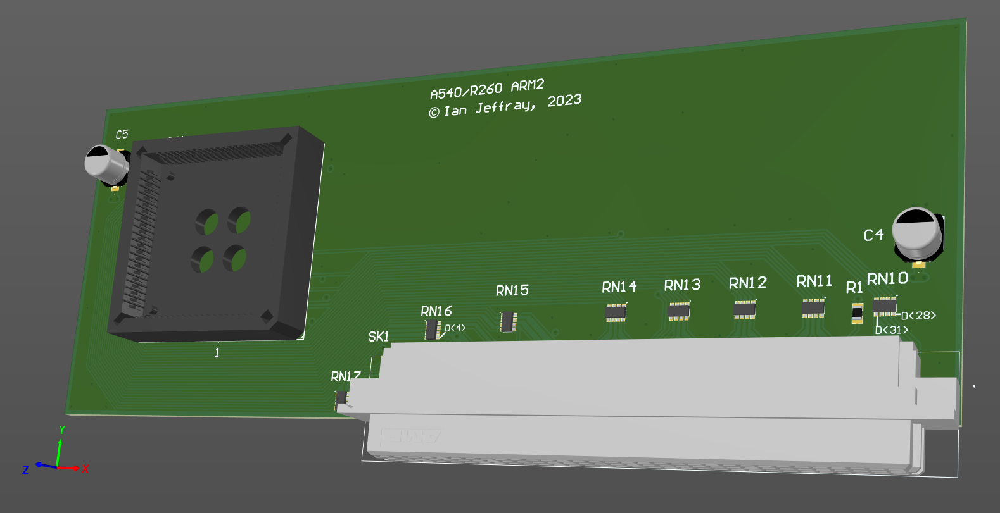

# Acorn A540/R260 ARM2 processor card

March 2023

This is my implementation of an ARM2 processor card for Acorn A540/R260 machines.

This has been built and lightly tested with no issues found.

It also successfully supports plugging several types of ARM3 upgrade in to it.

## Licence

No warranty is provided, and this work is used at your own risk.  

Licenced as CC BY-SA 3.0

Copyright 2023 Ian Jeffray

